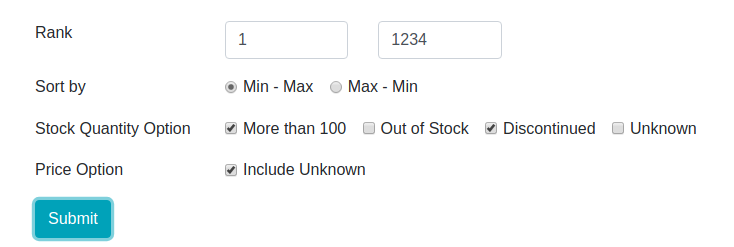

# Adafruit Best Seller

> MySQL (DB) + Redis (Cache) + Flask (Server) + jQuery (Front End) + Scrapy (Crawler)

## Directory structure

    .
    ├── crawler
    │   ├── __init__.py
    │   ├── adafruit.py         # The crawler
    │   ├── crawler.py          # Provide crawler instance
    │   ├── items.py
    │   └── pipelines.py        # Scrape pipeline, process and store data
    ├── imgs                    # Some pictures used in README
    ├── static
    │   ├── css
    │   └── js
    │       ├── index.js        # Send request, get response and display items
    │       └── ...
    ├── templates
    │   └── index.html
    ├── app.py                  # The server
    ├── data.py                 # Provide data access to server
    ├── scrape.py               # The crawler running in subprocess for periodical data update
    └── ...

## Get started

Install Python dependancy

`pip install -r requirements.txt` 

Install MySQL and Redis

[MySQL](https://dev.mysql.com/downloads/installer/)

[Redis](https://redis.io/topics/quickstart)

Change the username and password of MySQL in `data.py` and `crawler/pipelines.py`

Then run

`python app.py`

## The pipeline

#### Crawler

Initially, the Scrapy module is used to scrape data from the website and store into MySQL.

There are six fields for each row.

```
id CHAR(100)
url CHAR(100)
name CHAR(100)
price FLOAT
stock INT
img CHAR(100)
PRIMARY KEY (id)
```

All the items scraped will be processed and stored into DB in the item pipelines.


#### DB and Cache

Because wrting operation is really painful for MySQL, Redis is introduced for checking if the record is updated (only check stock information, because this is where our interest lies) and remove duplicated item. And this step is done in the crawler pipeline.

#### Server

Implemented RESTful API that provides JSON formatted data per request. The data can be filtered based on several conditions we provided. 



When the server started, always run the crawler first to update the database. After initialization, invoke a subprocess to run the crawler that scrape data every 30 minutes for database update. The update process is same with that in crawler, i.e. check the stock information in Redis cache first, update database only if changed.

#### Front End

Send form params (condition) to the server, get the response and display all the data page by page (50 items per page). Using jQuery Ajax to implement asynchronous request and pagination.

* The demo screenshot can be found in the imgs directory.
