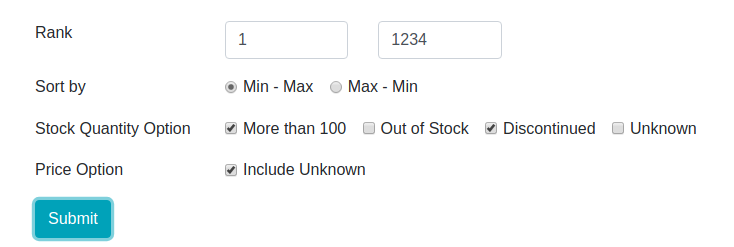

# Adafruit Best Seller

> MySQL (DB) + Redis (Cache) + Flask (Server) + jQuery (Front End) + Scrapy (Crawler)

## Prerequisites

Install Python dependancy

`pip install -r requirements.txt` 

Install MySQL and Redis

https://dev.mysql.com/downloads/installer/
https://redis.io/topics/quickstart

Change the username and password of MySQL in `data.py` and `crawler/pipelines.py`

Then run

`python app.py`

## The pipeline

#### Crawler

Initially, the Scrapy module is used to scrape data from the website and store into MySQL.

There are six columns for each row.

`id (PK), url, name, price, stock, img`

All the items scraped will be processed and stored into DB in the item pipelines.

#### DB and Cache

Because wrting operation is really painful for MySQL, Redis is introduced for checking if the record is updated (only check stock information, because this is where our interest lies) and remove duplicated item.

#### Server

Implemented RESTful API that provides JSON formatted data per request. The data can be filtered based on several conditions provided by user. 

Run the crawler first when the server started to update the database, and invoke a subprocess to run the crawler every 30 minutes for data update. The update process is same with that in crawler.

#### Front End

Using jQuery Ajax to implement asynchronous request and pagination.

JSONify the form data (condition) and send to the server, get the response and display all the data page by page.

* The demo screenshot can be found in the root directory.
